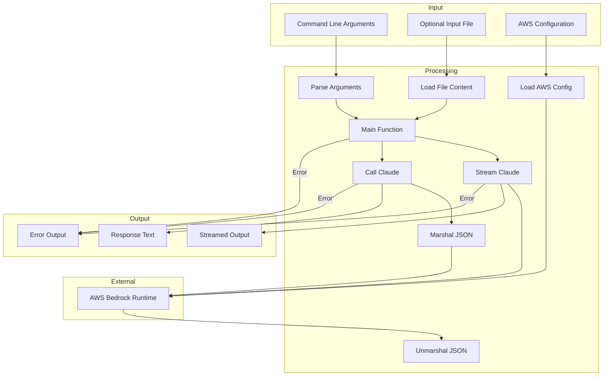

# Converse
CLI for simple Converse API calls to Claude Sonnet.

It offers no explanations or pleasantries, only code.

Requires AWS access - call `aws sso` to assume a suitable role with access to Bedrock.

# Run
```
converse -f app.py "write some unit tests"
converse -v 3.5 "bubble sort in C#"
```

In vim:
```
:r! converse "hash table in C"
```

# Install (Linux)
```
wget https://github.com/gerald1248/converse/releases/download/v1.0.6/converse-linux-amd64.zip
unzip converse-linux-amd64.zip
chmod +x converse
sudo cp converse /usr/local/bin/converse
```

# Build
```
make build
```

# Cross-compilation (Linux, Mac, Windows)
```
make xcompile
```

# Input/output flow


