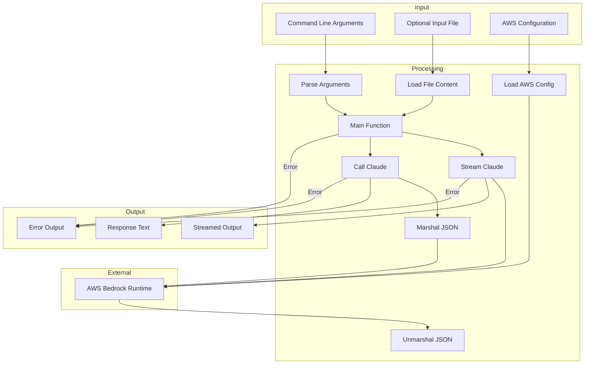

# Converse
CLI for simple Converse API calls to Claude Sonnet. From version 1.0.7 it defaults to Claude 4 Sonnet.

It offers no explanations or pleasantries, only code.

Requires AWS access - call `aws sso` to assume a suitable role with access to Bedrock.

# Run
```
converse -f app.py "write some unit tests"
converse -v 3.5 "bubble sort in C#"
```

In vim:
```
:r! converse "hash table in C"
```

# Usage
```
Usage: converse [--file] PROMPT

  -f string
        Optional file path to read (shorthand)
  -file string
        Optional file path to read
  -s    Stream tokens as they're generated (shorthand)
  -stream
        Stream tokens as they're generated
  -v string
        Optional Claude Sonnet version - 3, 3.5, 3.7 (shorthand) (default "4")
  -version string
        Optional Claude Sonnet version - 3, 3.5, 3.7 (default "4")
```

# Install (Linux)
```
wget https://github.com/gerald1248/converse/releases/download/v1.0.8/converse-linux-amd64.zip
unzip converse-linux-amd64.zip
chmod +x converse
sudo cp converse /usr/local/bin/converse
```

# Build
```
make build
```

# Cross-compilation (Linux, Mac, Windows)
```
make xcompile
```

# Input/output flow


